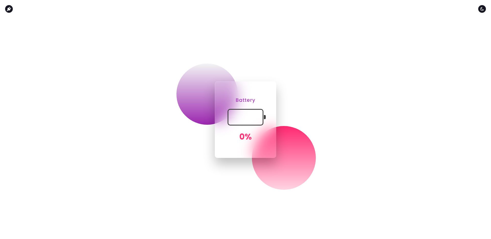

# glassmorphismBattery

<h1 align="center">
    Desenvolvimento de carregamento de Bateria.
</h1>

<h3 align="center">
  Projeto elaborado para fim de estudo de Javascript..
</h3>

<blockquote align="center">“Querer vencer significa já ter percorrido metade do caminho.”</blockquote>

  
  

<h2>
  Desenvolvimento
</h2>

Desafios para fortalecer alguns conceitos, entre eles:

- **HTML5**;
- **CSS3**;
- **Javascript**;

<h2>
  Visão do Projeto!
</h2>

  
  

<h2>
  Desktop!
</h2>

O design e construcção do HTML e CSS, foi feito pelo canal do youtube. 
Online Tutorials o link do vídeo é este: <a href="https://www.youtube.com/watch?v=xGWA7AVBRZA&list=PL5e68lK9hEzdn0O-OkMNNKHmP1iU6e6Dj&index=24&t=25s">Clique aqui</a>.
Minha parte neste projeto, foi somente a construção do arquivo javascript.
Então os créditos são para este canal que fez este lindo projeto.

<h2>
  Download do conteúdo!
</h2>

- Efetuar clone da aplicação;
- Abrir no navegador o projeto;

## :memo: Licença

Esse projeto está sob a licença MIT. Veja o arquivo [LICENSE](../LICENSE) para mais detalhes.
